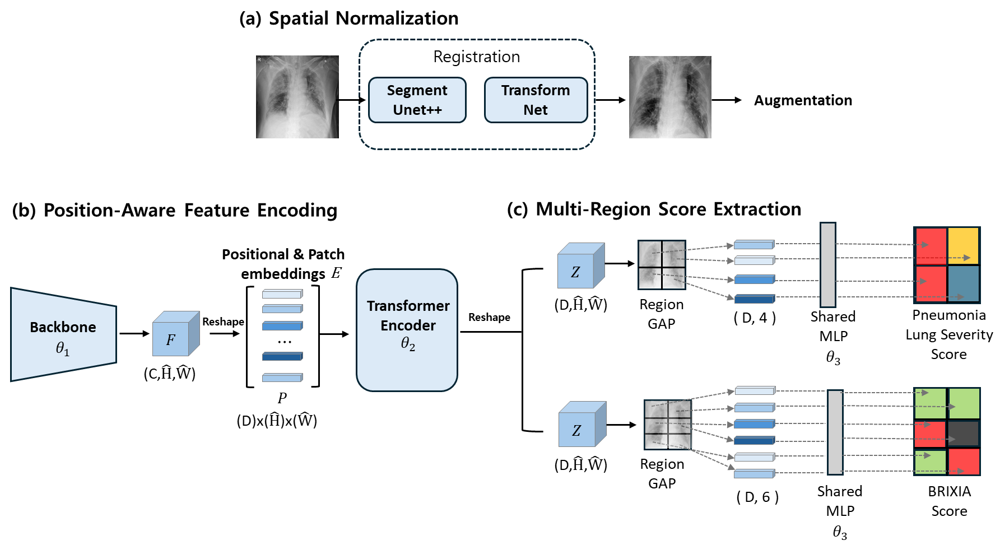
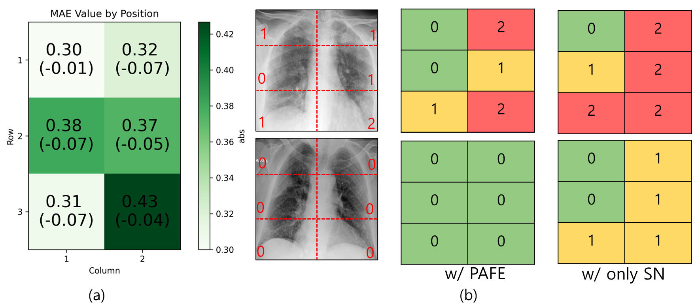

# Multi-Region Severity Assessment with Hybrid Network

This repository contains the implementation of a hybrid network for multi-region severity assessment of chest X-rays. The network combines Spatial Transformer Network (STN), segmentation, and classification components for accurate severity scoring.



## Pipeline Overview

1. Image preprocessing and segmentation
2. Spatial transformation for alignment
3. Region-based feature extraction
4. Multi-region severity scoring

## Setup and Usage

### 1. Dataset Preparation

1. Download the dataset (Ref Brixia dataset)
2. Preprocess images to 512x512 resolution:
```bash
python preprocess.py --input_dir /path/to/raw/images --output_dir processed_images
```

### 2. Segmentation Model

The segmentation model is pre-trained and available in `checkpoint/seg/seg_weights.pt`. It uses a HybridGNet style architecture for lung and heart segmentation. (Ref ngaggion/HybridGNet)


### 3. STN Training
First you need to do spatial normalization of the images.
Use opencv to do this. And save the images in the data/brixia/registration/images/
(I will update soon)

Train the Spatial Transformer Network:
```bash
python train_stn.py --batch_size 32 --epochs 100 --lr 0.001
```

The trained STN model will be saved in `checkpoint/stn/checkpoint.pth`.

Or you can use our pre-trained STN model.


### 4. End-to-End Training

Train the complete hybrid network:
```bash
python train_e2e.py \
    --arch hybrid_e2e_stn \
    --backbone resnet34 \
    --batch_size 64 \
    --epochs 100 \
    --lr 0.0001 \
    --momentum 0.9 \
    --weight_decay 1e-4
```

### 5. Testing

Evaluate the model:
```bash
python test_e2e.py \
    --arch hybrid_e2e_stn \
    --backbone resnet34 \
    --checkpoint_path /path/to/checkpoint
```

## Model Architecture

The hybrid network consists of three main components:

1. **Segmentation Module**: Identifies lung and heart regions
2. **STN Module**: Aligns the image based on anatomical landmarks
3. **Classification Module**: Assesses severity in multiple regions


## Directory Structure

```
.
├── checkpoint/
│   ├── seg/
│   │   └── seg_weights.pt
│   └── stn/
│       └── checkpoint.pth
├── data/
│   └── brixia/
│       ├── metadata_consensus_v1.csv        # Consensus labels for test
│       ├── metadata_global_v2_all.csv       # All metadata
│       ├── metadata_global_v2_process.csv   # Processed metadata for training
│       ├── processed_images/                # Preprocessed 512x512 images
│       └── registration/
│           └── images/                      # Original images
├── modules/
│   ├── model.py
│   ├── dataset.py
│   └── stn.py
├── segementation/
│   ├── HybridGNet2IGSC.py
│   └── modelUtils.py
├── seg_utils/
│   └── utils.py
├── figures/
│   ├── FIG1.png
│   └── FIG3.png
├── train_e2e.py
├── test_e2e.py
└── train_stn.py
```

## Results

The model achieves state-of-the-art performance in multi-region severity assessment:




## Requirements

- Python 3.8+
- PyTorch 1.8+
- CUDA 11.0+ (for GPU support)

## Changelog

### 2024.03
- Initial release
- Basic training pipeline
- Dataset preprocessing tools
- Model architecture implementation


### 2025.05
- Added end-to-end training pipeline
- Implemented hybrid network with STN and segmentation


## TODO

- Upload prepreocessing code
- Upload spatial normalization code using opencv to train STN model


## Citation

If you find this work useful, please cite our paper:
```
@InProceedings{Lee_COVID19_MICCAI2024,
        author = { Lee, Jong Bub and Kim, Jung Soo and Lee, Hyun Gyu},
        title = { { COVID19 to Pneumonia: Multi Region Lung Severity Classification using CNN Transformer Position-Aware Feature Encoding Network } },
        booktitle = {proceedings of Medical Image Computing and Computer Assisted Intervention -- MICCAI 2024},
        year = {2024},
        publisher = {Springer Nature Switzerland},
        volume = {LNCS 15001},
        month = {October},
        page = {472 -- 481}
}
```


